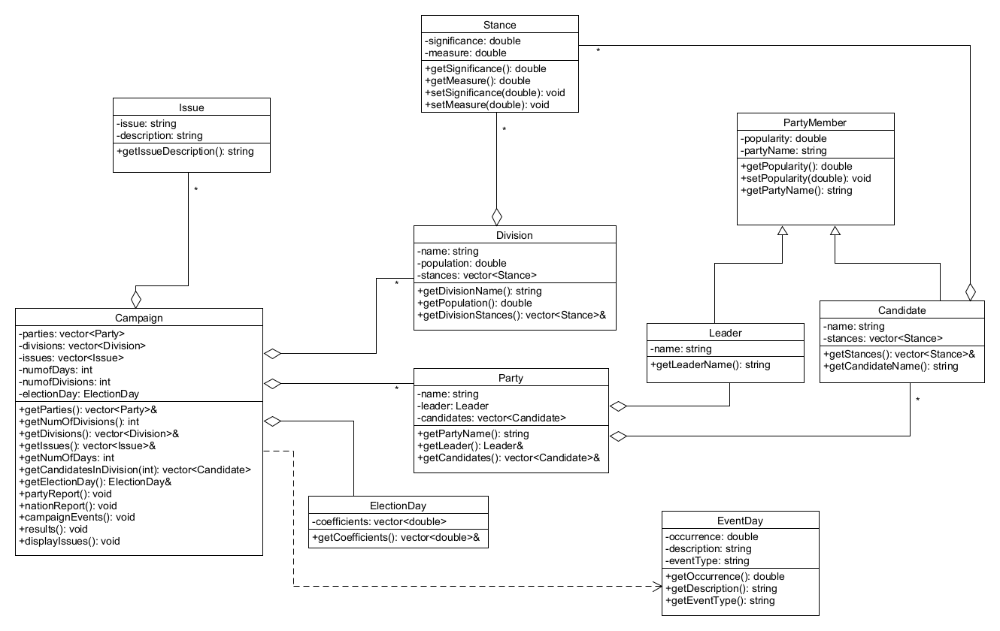

# Parliamentary Voting Simulation (C++)

## Overview
This project is a C++ simulation of a parliamentary election system where multiple political factions compete across electoral divisions using candidate-based voting dynamics. The simulation models campaign events, voter influence, and final election outcomes across multiple rounds.

Factions are inspired by fictional One Piece crews (used as thematic placeholders for political parties).

## Features
- Multi-party election simulation
- Division-based voting system
- Candidate and leader influence modeling
- Randomized campaign events affecting popularity and stances
- Score-based election outcome calculation
- Detection of majority win or hung parliament

## Project Structure
- `main.cpp` → program entry point and argument handling  
- `header.h` → class declarations  
- `Campaign.cpp` → simulation logic and campaign flow  
- `memberFunctions.cpp` → class implementations  

## UML Diagram
The system design is illustrated below:

## Key Concepts Used
- Object-Oriented Programming (inheritance, encapsulation)
- Multi-class system design
- Randomized simulation (normal & uniform distributions)
- Nested iteration over hierarchical data (parties → candidates → stances → divisions)
- Weighted scoring model for election results

## Design Notes
The implementation prioritizes correctness and simulation behavior over performance optimization. Some sections use nested loops and iterative computation which could be refactored for efficiency in larger-scale systems.

## What I Learned
- Designing multi-class C++ systems
- Structuring simulation-based applications
- Managing complex data relationships
- Applying probability and randomness in modeling real-world systems
- Building and organizing multi-file C++ projects
